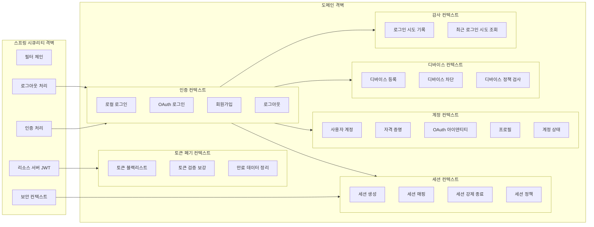
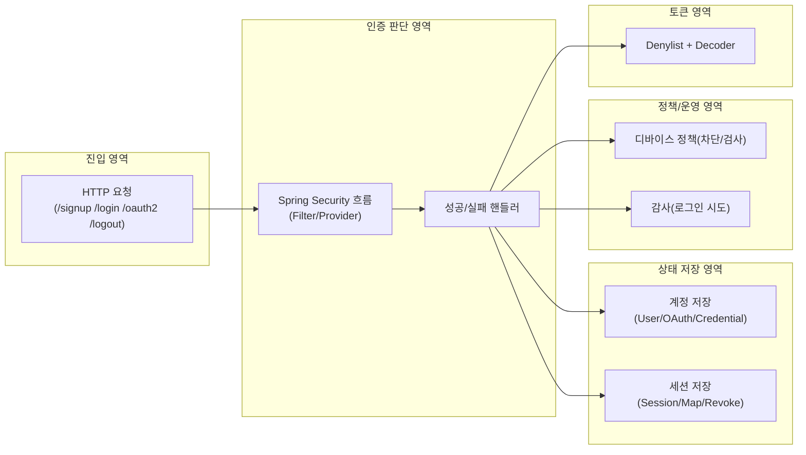

```mermaid
flowchart LR
  subgraph FW[스프링 시큐리티 격벽]
    FW1[필터 체인]
    FW2[인증 처리]
    FW3[보안 컨텍스트]
    FW4[리소스 서버 JWT]
    FW5[로그아웃 처리]
  end

  subgraph CORE[도메인 격벽]
      subgraph BC6[토큰 폐기 컨텍스트]
          T1[토큰 블랙리스트]
          T2[토큰 검증 보강]
          T3[만료 데이터 정리]
      end
      
      subgraph BC3[세션 컨텍스트]
          S1[세션 생성]
          S2[세션 매핑]
          S3[세션 강제 종료]
          S4[세션 정책]
      end
  
    subgraph BC1[인증 컨텍스트]
      A1[로컬 로그인]
      A2[OAuth 로그인]
      A3[회원가입]
      A4[로그아웃]
    end

    subgraph BC2[계정 컨텍스트]
      U1[사용자 계정]
      U2[자격 증명]
      U3[OAuth 아이덴티티]
      U4[프로필]
      U5[계정 상태]
    end

    subgraph BC4[디바이스 컨텍스트]
      D1[디바이스 등록]
      D2[디바이스 차단]
      D3[디바이스 정책 검사]
    end

    subgraph BC5[감사 컨텍스트]
      L1[로그인 시도 기록]
      L2[최근 로그인 시도 조회]
    end
  end

  %% 선 최소화: 프레임워크 ↔ 도메인 접점만 표현
  FW2 --> BC1
  FW3 --> BC3
  FW4 --> BC6
  FW5 --> BC1

  %% 도메인 내부도 최소 연결: 인증이 각 컨텍스트를 트리거한다는 수준만 표시
  BC1 --> BC2
  BC1 --> BC3
  BC1 --> BC4
  BC1 --> BC5
```

---

```mermaid
flowchart LR
  subgraph A["진입 영역"]
    IN["HTTP 요청\n(/signup /login /oauth2 /logout)"]
  end

  subgraph B["인증 판단 영역"]
    SEC["Spring Security 흐름\n(Filter/Provider)"]
    DEC["성공/실패 핸들러"]
  end

  subgraph C["상태 저장 영역"]
    AC["계정 저장(User/OAuth/Credential)"]
    SE["세션 저장(Session/Map/Revoke)"]
  end

  subgraph D["정책/운영 영역"]
    DV["디바이스 정책(차단/검사)"]
    AU["감사(로그인 시도)"]
  end

  subgraph E["토큰 영역"]
    TK["Denylist + Decoder"]
  end

  IN --> SEC --> DEC --> AC
  DEC --> SE
  DEC --> DV
  DEC --> AU
  DEC --> TK

```

