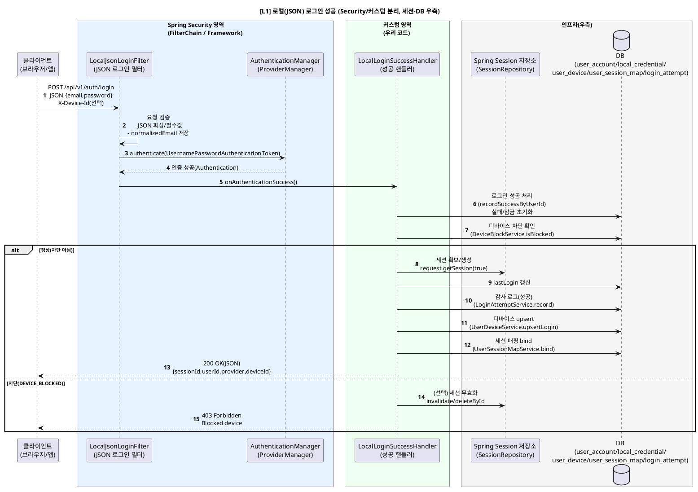
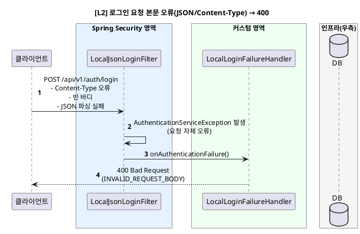
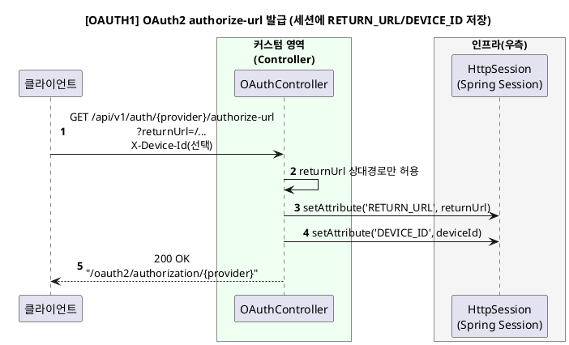
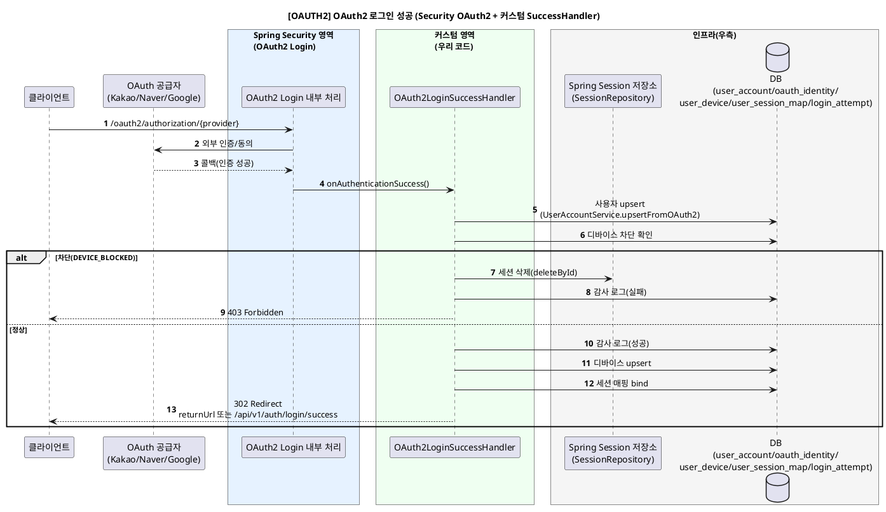
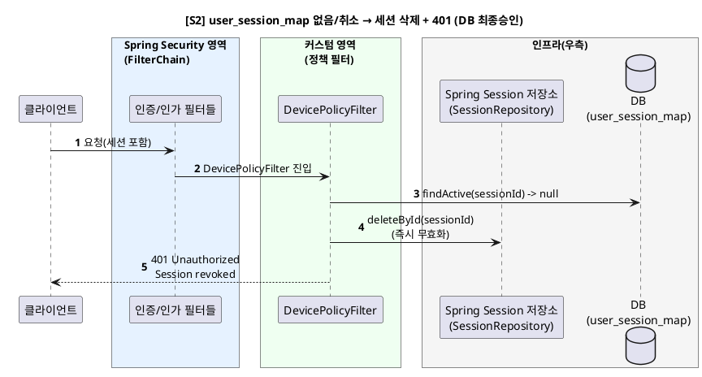
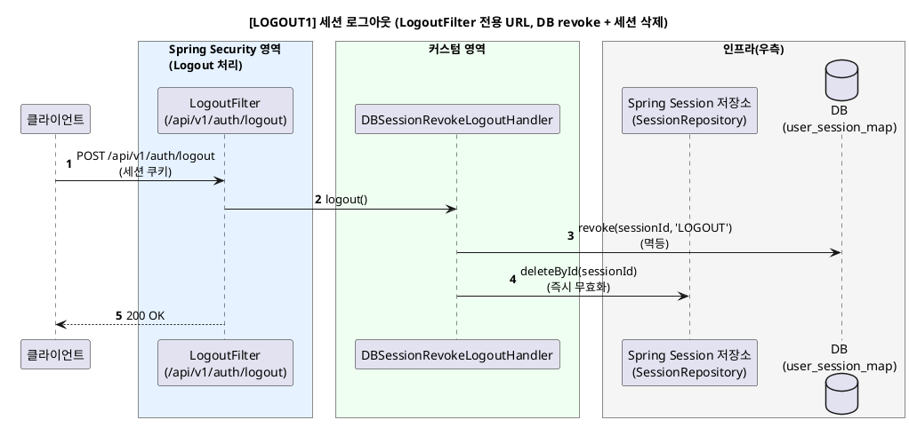
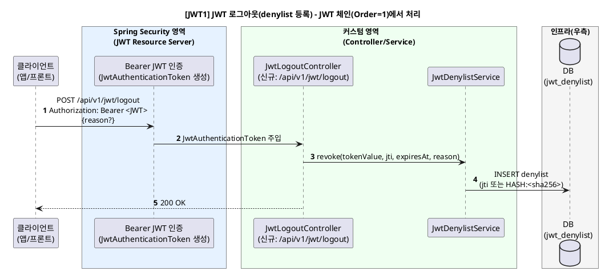

# 사용자 인증·세션 보안 최종 보고서 (Spring Security 구현 기반)

* 문서 버전: v1.0
* 기준 일자: 2026-01-19
* 적용 범위:

    * **Session 기반**: `/api/v1/auth/**`, `/oauth2/**`, `/login/**`
    * **JWT 기반(API)**: `/api/**` (단, `/api/v1/auth/**` 제외)
* 인증/세션 전략(요약):

    * **Session 로그인(Local/OAuth2)**: Spring Security Session + `user_session_map`(DB 최종 승인) + `DevicePolicyFilter`
    * **JWT API 접근**: OAuth2 Resource Server(JWT) + Stateless
    * **무효화(Revocation)**:

        * Session: `user_session_map revoke + SessionRepository.deleteById()`로 즉시 무효화
        * JWT: `jwt_denylist` 등록(※ 인증 단계에서 denylist 검증 연동 시 실효)

---

## 0. (핵심 수정 반영) 로그아웃 URL 충돌 해결 정책

### 문제(기존)

* Session 체인에서 `logoutUrl("/api/v1/auth/logout")`를 **LogoutFilter**가 처리
* 동시에 컨트롤러가 `POST /api/v1/auth/logout`를 매핑하면,

    * **필터가 먼저 응답을 끝내서 컨트롤러가 실행되지 않음**
    * 혹은 운영자가 의도한 “JWT 로그아웃”이 동작하지 않는 혼선 발생

### 해결(이번 최종안 적용)

* **세션 로그아웃**: `/api/v1/auth/logout` (LogoutFilter 전용)
* **JWT 로그아웃(denylist)**: `/api/v1/jwt/logout` (JWT 체인(Order=1)에서 인증됨)

> 즉, “세션 기반 로그아웃”과 “JWT 로그아웃”은 **URL + 체인 경계**가 분리되어 충돌이 발생하지 않습니다.

---

# 1. 시스템 개요

## 1.1 구성요소

* 클라이언트(브라우저/앱): 로컬 JSON 로그인 또는 OAuth2 로그인 수행
* API 서버(Spring Boot + Spring Security)

    * **FilterChain #1 (Order=1)**: JWT Stateless (`/api/**`, 단 `/api/v1/auth/**` 제외)
    * **FilterChain #2 (Order=2)**: Session/OAuth2/LocalLogin (`/api/v1/auth/**`, `/oauth2/**` 등)
* DB(핵심 테이블 성격)

    * `user_session_map`: 세션-유저-디바이스 바인딩 + revoke 기록(**세션 최종 승인자**)
    * `user_device`: 디바이스 상태(ACTIVE/BLOCKED) 및 최근 접속 정보
    * `local_credential`: 로그인 실패/잠금 정책 상태
    * `login_attempt`: 로그인 시도 감사 로그
    * `jwt_denylist`: JWT revoke 저장소
    * `user_account`, `oauth_identity`: 계정/소셜 매핑
* Spring Session 저장소(SessionRepository/FindByIndexNameSessionRepository)

    * 세션 row 삭제로 **즉시 무효화(강제 로그아웃)**

## 1.2 핵심 원칙

1. **세션이 있어도 DB 최종 승인(user_session_map)이 없으면 무효**
2. **디바이스 차단은 즉시 효력**: 요청 즉시 세션 삭제 + 403
3. **Session 체인과 JWT 체인을 분리**하여 책임/보안 경계를 명확화
4. **감사 로그(login_attempt)** 로 추적 가능성 확보
5. JWT 로그아웃은 **denylist 기반**이며, 실제 차단은 인증 단계 연동이 필수

---

# 2. Spring Security 경계 구조

## 2.1 FilterChain #1 (Order=1) — JWT Stateless

* 대상: `/api/**` AND NOT `/api/v1/auth/**`
* 특징:

    * `oauth2ResourceServer().jwt()`
    * `SessionCreationPolicy.STATELESS`
    * `csrf.disable()`
    * 모든 요청 인증 필요
* 포함되는 주요 엔드포인트(예):

    * ✅ `/api/v1/jwt/logout` (JWT 로그아웃, denylist 등록)
    * ✅ `/api/**` 자원 서버 API들

## 2.2 FilterChain #2 (Order=2) — Session/OAuth2/Local Login

* 대상: `/api/v1/auth/**`, `/oauth2/**`, `/login/**` 등
* 특징:

    * Local JSON 로그인: `LocalJsonLoginFilter`가 `/api/v1/auth/login` 처리
    * OAuth2 로그인: Success/Failure 핸들러 커스텀
    * 로그인 이후 정책: `DevicePolicyFilter`로 세션 최종 승인 및 디바이스 차단 검증
    * 세션 로그아웃: LogoutFilter + `DBSessionRevokeLogoutHandler`

---

# 3. 기능별 시퀀스 다이어그램 + 동작 과정

## 3.1 로컬(JSON) 로그인

### [L1] 정상 로그인 성공 — `/api/v1/auth/login`

**동작 과정(설명)**

* `/api/v1/auth/login`은 **컨트롤러가 아니라 `LocalJsonLoginFilter`**가 직접 처리합니다.
* 성공 시 `LocalLoginSuccessHandler`가:

    1. 잠금/실패 초기화
    2. 디바이스 차단 검사
    3. 세션 생성/확보
    4. `user_session_map` 바인딩 저장
    5. 감사 로그 저장
       을 수행합니다.
* 이후 요청은 `DevicePolicyFilter`에서 “세션이 있어도 DB가 승인하지 않으면 무효” 정책을 계속 적용합니다.

**구현 포인트**

* 필터 진입점: `LocalLoginFilterConfig.localJsonLoginFilter()`
* 성공 처리: `LocalLoginSuccessHandler`
* 세션 바인딩: `UserSessionMapService.bind(sessionId, userId, deviceId, AuthProvider.LOCAL)`

---

### [L2] 요청 본문(JSON) 오류 → 400 (잠금 카운트 미상승)

**동작 과정(설명)**

* “비밀번호 오류(401)”가 아니라 **요청 자체가 잘못된 케이스**로 분리하여 400 처리합니다.
* 이 흐름은 잠금 정책과 분리되어 **불필요한 잠금 누적을 방지**합니다.

---

### [L3/L4] 인증 실패/잠금 → 401 또는 429

* `LocalLoginPolicyService.recordFailureByEmail()`에서 실패 카운트 누적 및 잠금 처리
* `LocalLoginFailureHandler` 응답:

    * `BAD_CREDENTIALS/NOT_FOUND` → **401**
    * `LOCKED` → **429**

---

## 3.2 OAuth2 로그인

### [OAUTH1] authorize-url 발급 + 세션에 returnUrl/deviceId 저장

**동작 과정(설명)**

* OAuth2 시작 전에 returnUrl/deviceId를 세션에 저장해 성공 시 핸들러에서 사용합니다.
* returnUrl은 “상대 경로만 허용”으로 오픈 리다이렉트 위험을 줄입니다.

---

### [OAUTH2] OAuth2 로그인 성공 → 계정 upsert + 디바이스/세션 매핑 + redirect

**동작 과정(설명)**

* OAuth2 성공 시에도 로컬 로그인과 동일하게 디바이스/세션 매핑이 저장됩니다.
* 차단 디바이스는 즉시 세션을 삭제하여 “로그인 성공 상태”가 남지 않게 합니다.

---

## 3.3 세션 최종 승인(DevicePolicyFilter)

### [S2] 세션 매핑 revoke/없음 → 세션 즉시 삭제 + 401

**동작 과정(설명)**

* 세션이 존재해도 `user_session_map`이 revoke/미존재면 즉시 세션 저장소에서 삭제합니다.
* 결과적으로 “세션은 서버에 남아있는데 DB에서는 취소됨” 같은 불일치 상태를 오래 유지하지 않습니다.

---

## 3.4 로그아웃(세션 기반)

### [LOGOUT1] `/api/v1/auth/logout` → DB revoke + 세션 삭제 (충돌 없음: LogoutFilter 전용)

**동작 과정(설명)**

* 로그아웃은 “DB revoke + 세션 삭제”를 같이 수행해 즉시 무효화합니다.
* 이 URL은 이제 **세션 로그아웃 전용**이므로 컨트롤러와 충돌하지 않습니다.

---

## 3.5 JWT 로그아웃(denylist)

### [JWT1] `/api/v1/jwt/logout` → denylist 등록 (JWT 체인에서 인증됨)

**동작 과정(설명)**

* Stateless 환경에서는 “발급된 JWT 자체”를 서버가 즉시 파기할 수 없으므로, denylist에 등록해 차단합니다.
* `/api/v1/jwt/logout`은 `/api/v1/auth/**`가 아니므로 **JWT 체인에 포함**되어 `JwtAuthenticationToken`이 안정적으로 주입됩니다.

**구현 포인트**

* `JwtDenylistService.revoke()`는 `jti`가 없을 때도 `HASH:<tokenHash>`로 저장하여 방어합니다.
* (중요) 실제 차단을 위해서는 **JWT 검증 단계에서 `isRevoked()`가 호출**되어야 합니다(Validator/Decoder 연동 필요).

---

# 4. 운영 가이드(중요)

* **세션 로그인(Local/OAuth2)을 쓰는 클라이언트**

    * 로그아웃: `POST /api/v1/auth/logout` (세션 쿠키 기반)
* **JWT API를 쓰는 클라이언트(모바일/외부 API)**

    * 로그아웃: `POST /api/v1/jwt/logout` (Bearer JWT 기반)

> “세션 로그인인데 JWT 로그아웃만 호출”하거나, “JWT 기반인데 세션 로그아웃만 호출”하면 기대한 무효화가 되지 않을 수 있으므로, 클라이언트 타입별 호출을 분리합니다.

---

# 5. 보안효과 요약(결론)

1. **세션 기반 인증의 약점을 DB 최종승인 구조로 보완**

* 세션이 있어도 `user_session_map`이 revoke면 즉시 삭제 + 401

2. **디바이스 차단의 즉시 효력**

* `DevicePolicyFilter`에서 차단 디바이스면 즉시 세션 삭제 + 403

3. **로그인 잠금/감사로 침해 탐지 및 대응**

* LocalCredential 기반 잠금(429)
* LoginAttempt 로그로 이상 패턴 추적

4. **JWT revoke(denylist)로 Stateless 보완**

* denylist 등록으로 “서버 정책에 의한 JWT 차단” 가능
* 단, 실효성은 **JWT 인증 단계 denylist 검증 연동**이 필수

---
