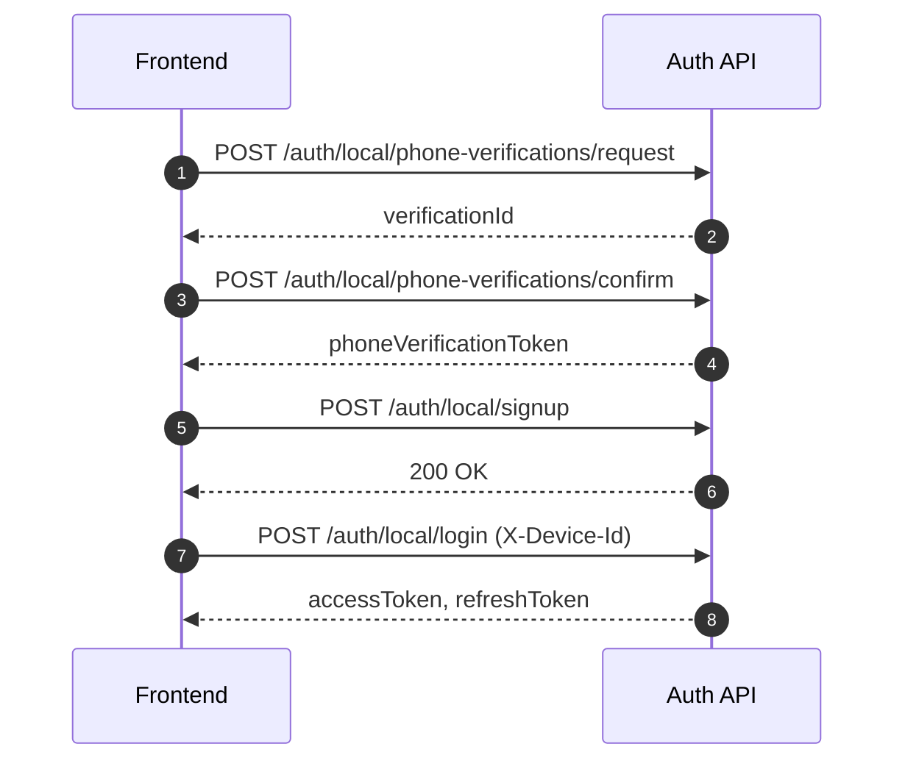
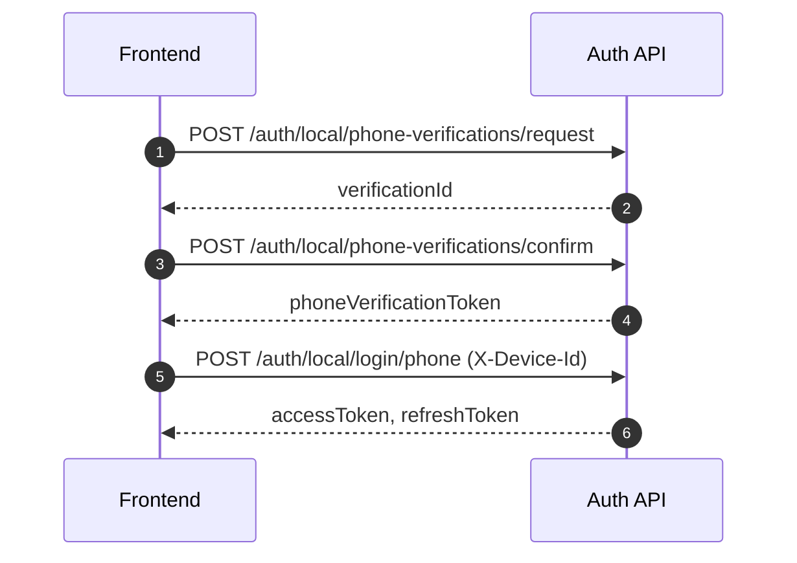
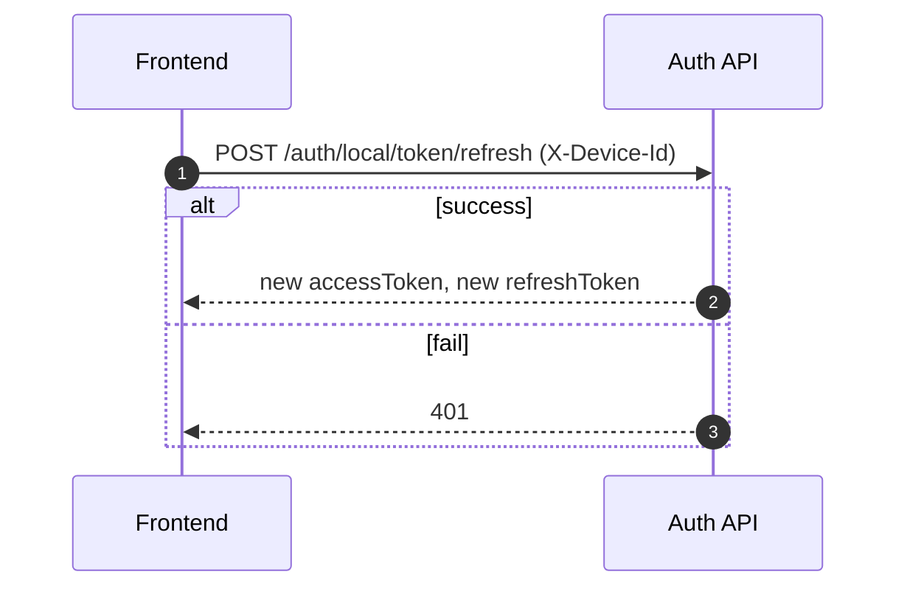

# 인증 서비스 프론트엔드 API 가이드 (사용자 전용)

이 문서는 사용자 API만 다룹니다. 관리자 API(`/api/v1/auth/admin/*`)는 제외합니다.

## 1) 문서 확인 경로
- Redoc: `http://localhost:8080/docs/index.html`
- Swagger: `http://localhost:8080/docs/swagger/index.html`
- OpenAPI YAML: `http://localhost:8080/docs/openapi3.yaml`

## 2) 카테고리

### Health
- `GET /health`

### Local Phone
- `POST /api/v1/auth/local/phone-verifications/request`
- `POST /api/v1/auth/local/phone-verifications/confirm`

### Local Auth
- `POST /api/v1/auth/local/signup`
- `POST /api/v1/auth/local/signup/phone`
- `POST /api/v1/auth/local/login`
- `POST /api/v1/auth/local/login/phone`
- `POST /api/v1/auth/local/token/refresh`
- `POST /api/v1/auth/local/logout`
- `POST /api/v1/auth/local/withdraw`

### OAuth2
- `GET /api/v1/auth/oauth2/{provider}/authorize-url`

## 3) 공통 규칙

### 헤더
- 사용자 인증: `Authorization: Bearer {accessToken}`
- 디바이스 식별: `X-Device-Id: {deviceId}`

### 공통 에러 처리
- `400`: 요청 필드 검증 실패
- `401`: 인증 실패/토큰 만료
- `403`: 권한 없음
- `409`: 중복 데이터 충돌

## 4) 핵심 시퀀스

### 4-1) 휴대폰 인증 + 회원가입 + 이메일 로그인


### 4-2) 휴대폰 인증 + 휴대폰 로그인


### 4-3) 토큰 재발급


## 5) API 상세

### A. 휴대폰 인증번호 발급
- `POST /api/v1/auth/local/phone-verifications/request`
- Request
```json
{
  "phoneNumber": "+821012345678"
}
```
- Response `data`
```json
{
  "verificationId": "uuid",
  "expiresInSec": 180
}
```

### B. 휴대폰 인증번호 확인
- `POST /api/v1/auth/local/phone-verifications/confirm`
- Request
```json
{
  "phoneNumber": "+821012345678",
  "verificationId": "uuid",
  "code": "123456"
}
```
- Response `data`
```json
{
  "phoneVerificationToken": "uuid",
  "expiresInSec": 600
}
```

### C. 이메일 회원가입
- `POST /api/v1/auth/local/signup`
- 필수: `email`, `password`, `gender`, `phoneNumber`, `phoneVerificationToken`

### D. 휴대폰 간편 회원가입
- `POST /api/v1/auth/local/signup/phone`
- Request
```json
{
  "phoneNumber": "+821012345678",
  "phoneVerificationToken": "uuid"
}
```

### E. 이메일 로그인
- `POST /api/v1/auth/local/login`
- Request
```json
{
  "email": "user@example.com",
  "password": "P@ssw0rd!"
}
```

### F. 휴대폰 로그인
- `POST /api/v1/auth/local/login/phone`
- Header: `X-Device-Id` 필수
- Request
```json
{
  "phoneNumber": "+821012345678",
  "phoneVerificationToken": "uuid"
}
```

### G. 토큰 재발급
- `POST /api/v1/auth/local/token/refresh`
- Header: `X-Device-Id` 필수

### H. 로그아웃
- `POST /api/v1/auth/local/logout`
- Header: `Authorization`, `X-Device-Id`

### I. 회원 탈퇴
- `POST /api/v1/auth/local/withdraw`
- Header: `Authorization`

### J. OAuth2 인가 URL 조회
- `GET /api/v1/auth/oauth2/{provider}/authorize-url`
- Query: `returnUrl` (선택, `/`로 시작)
