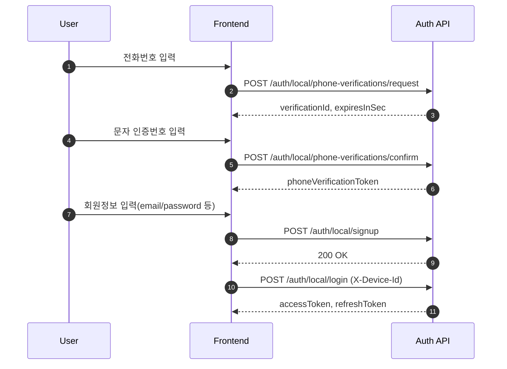
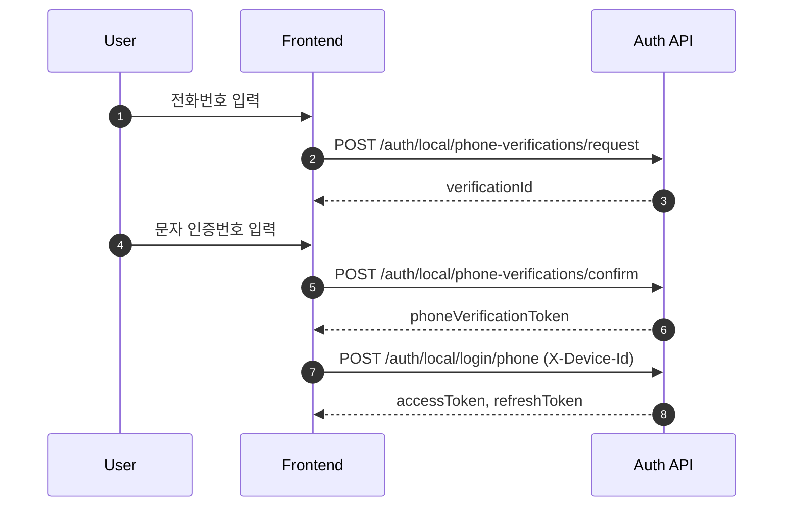
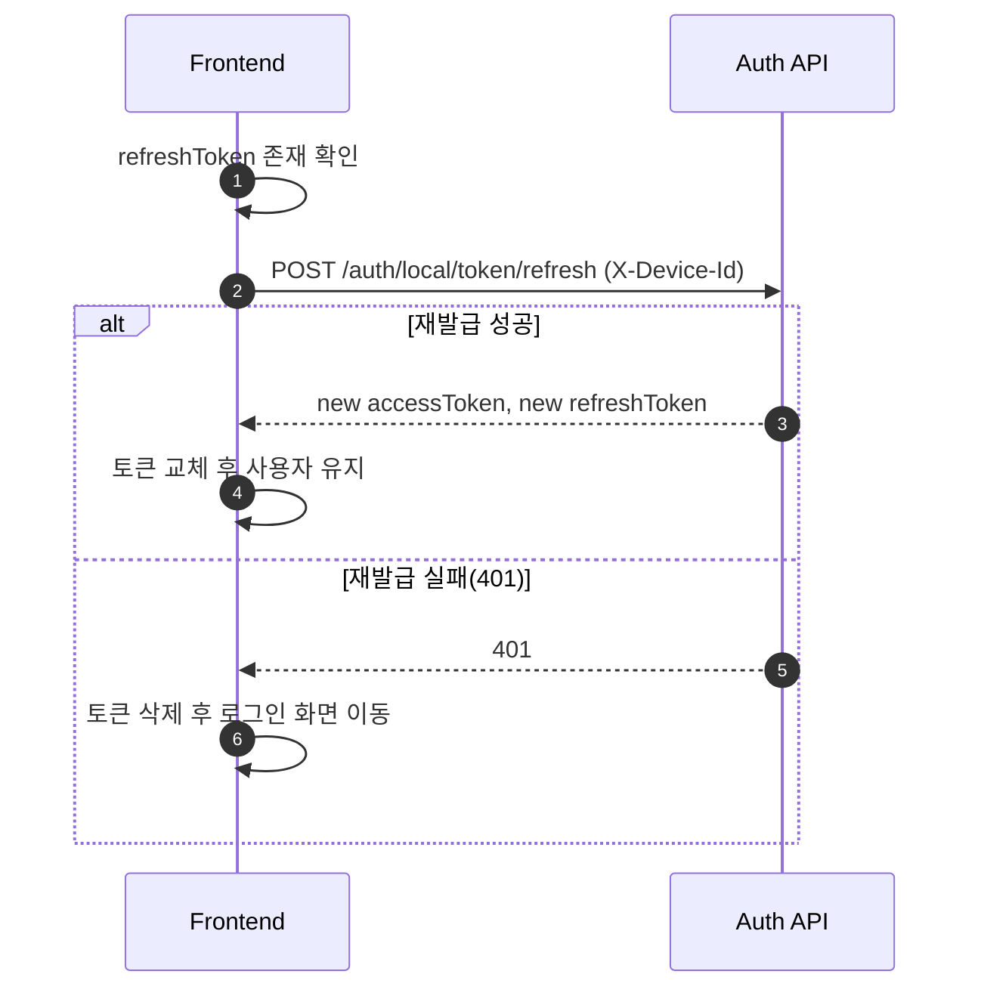
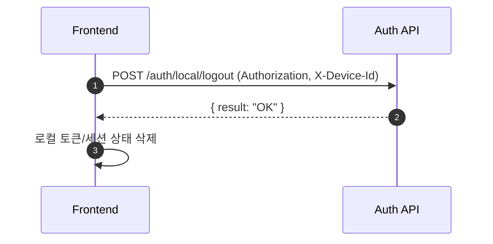
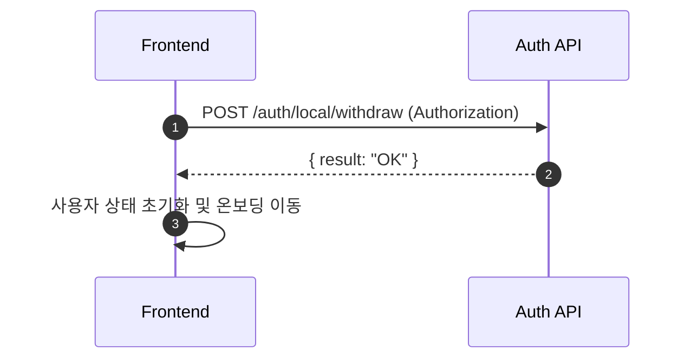
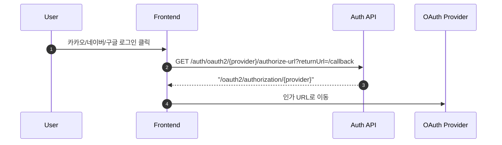

# 프론트엔드 사용자 API 개발 가이드

이 문서는 **사용자 API만** 다룹니다.  
관리자 API(`/api/v1/auth/admin/*`)는 본 문서에서 제외합니다.

## 1) API 확인 위치

- Redoc: `http://localhost:8080/docs/index.html`
- Swagger: `http://localhost:8080/docs/swagger/index.html`
- OpenAPI 원본: `http://localhost:8080/docs/openapi3.yaml`
- 사용자 요약 문서: [core/core-api/src/main/resources/static/docs/frontend-api-guide.md](../core/core-api/src/main/resources/static/docs/frontend-api-guide.md)

## 2) 사용자 API 카테고리

### A. Health
- `GET /health`

### B. Local Phone (휴대폰 인증)
- `POST /api/v1/auth/local/phone-verifications/request`
- `POST /api/v1/auth/local/phone-verifications/confirm`

### C. Local Auth (회원가입/로그인/세션)
- `POST /api/v1/auth/local/signup`
- `POST /api/v1/auth/local/signup/phone`
- `POST /api/v1/auth/local/login`
- `POST /api/v1/auth/local/login/phone`
- `POST /api/v1/auth/local/token/refresh`
- `POST /api/v1/auth/local/logout`
- `POST /api/v1/auth/local/withdraw`

### D. OAuth2 시작 URL
- `GET /api/v1/auth/oauth2/{provider}/authorize-url`

## 3) 공통 규칙

### 헤더
- 사용자 인증: `Authorization: Bearer {accessToken}`
- 디바이스 식별(필수 API): `X-Device-Id: {deviceId}`

### 공통 에러 처리
- `401`: 토큰 만료/무효 -> refresh 시도 후 실패 시 로그인 화면 이동
- `403`: 권한 없음
- `400`: 요청 검증 실패(폼 에러 매핑)

### 토큰 저장 권장
- accessToken: 메모리 저장(상태관리)
- refreshToken: 보안 저장소(HTTP-only 쿠키 또는 안전한 앱 저장소)

## 4) 시퀀스 다이어그램 (GitHub 렌더링용)

### 4-1) 휴대폰 인증 + 이메일 회원가입 + 로그인



### 4-1-b) 휴대폰 인증 + 휴대폰 로그인



### 4-2) 앱 재진입 시 토큰 재발급



### 4-3) 로그아웃



### 4-4) 회원 탈퇴



### 4-5) 소셜 로그인 시작



## 5) API 상세 사용법

### A. 휴대폰 인증번호 발급
- `POST /api/v1/auth/local/phone-verifications/request`
- Request
```json
{
  "phoneNumber": "+821012345678"
}
```
- Response `data`
```json
{
  "verificationId": "uuid",
  "expiresInSec": 180
}
```

### B. 휴대폰 인증번호 확인
- `POST /api/v1/auth/local/phone-verifications/confirm`
- Request
```json
{
  "phoneNumber": "+821012345678",
  "verificationId": "uuid",
  "code": "123456"
}
```
- Response `data`
```json
{
  "phoneVerificationToken": "uuid",
  "expiresInSec": 600
}
```

### C. 이메일 회원가입
- `POST /api/v1/auth/local/signup`
- 필수: `email`, `password`, `gender`, `phoneNumber`, `phoneVerificationToken`
- 선택: `name`, `nickname`, `locale`, `profileImageUrl`, `thumbnailImageUrl`, `birthyear`, `birthday`

### D. 휴대폰 간편 회원가입
- `POST /api/v1/auth/local/signup/phone`
- Request
```json
{
  "phoneNumber": "+821012345678",
  "phoneVerificationToken": "uuid"
}
```

### E. 로그인
- `POST /api/v1/auth/local/login`
- Header: `X-Device-Id` 권장
- Request
```json
{
  "email": "user@example.com",
  "password": "P@ssw0rd!"
}
```
- Response `data`: `accessToken`, `refreshToken`, 만료 시간

### E-2. 휴대폰 로그인
- `POST /api/v1/auth/local/login/phone`
- Header: `X-Device-Id` 필수
- Request
```json
{
  "phoneNumber": "+821012345678",
  "phoneVerificationToken": "uuid"
}
```
- Response `data`: `accessToken`, `refreshToken`, 만료 시간

### F. 토큰 재발급
- `POST /api/v1/auth/local/token/refresh`
- Header: `X-Device-Id` 필수
- Request
```json
{
  "refreshToken": "..."
}
```

### G. 로그아웃
- `POST /api/v1/auth/local/logout`
- Header: `Authorization`, `X-Device-Id`
- Request(선택)
```json
{
  "refreshToken": "...",
  "logoutAll": false
}
```

### H. 회원 탈퇴
- `POST /api/v1/auth/local/withdraw`
- Header: `Authorization`
- Request(선택)
```json
{
  "reason": "privacy"
}
```

### I. OAuth2 인가 URL 조회
- `GET /api/v1/auth/oauth2/{provider}/authorize-url`
- Query: `returnUrl` (선택, 반드시 `/`로 시작)
- Header: `X-Device-Id` (선택)
- Response `data`
```json
"/oauth2/authorization/{provider}"
```

## 6) 프론트 구현 체크리스트

- `X-Device-Id` 필요한 API에 누락이 없는가
- 401 처리에서 refresh 단일 비행(single flight) 제어가 되는가
- refresh 실패 시 토큰 정리 + 로그인 이동이 되는가
- 회원가입 전 휴대폰 인증 시퀀스를 강제하는가
- OpenAPI 스펙과 타입/DTO가 일치하는가
