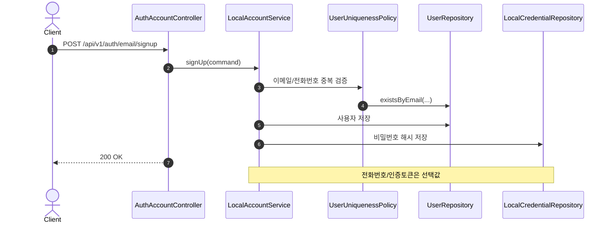
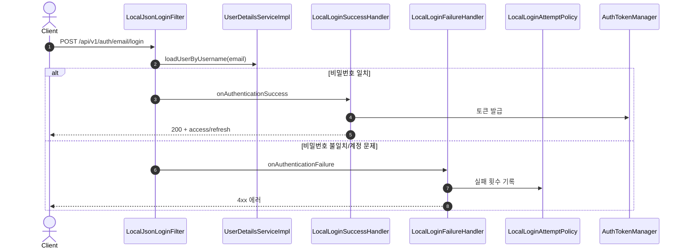
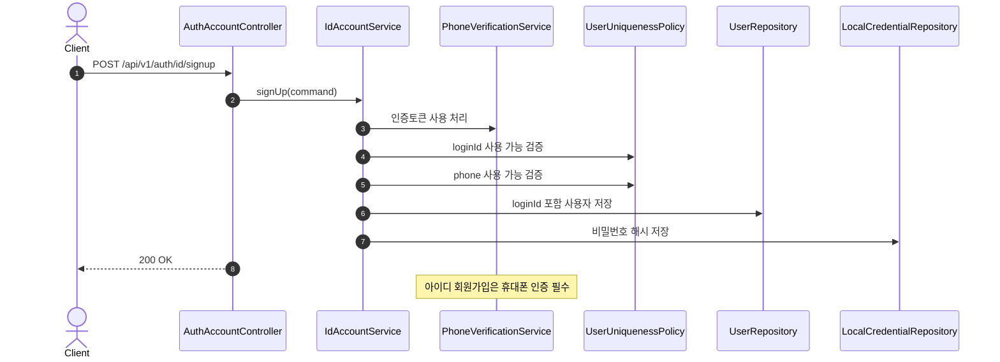
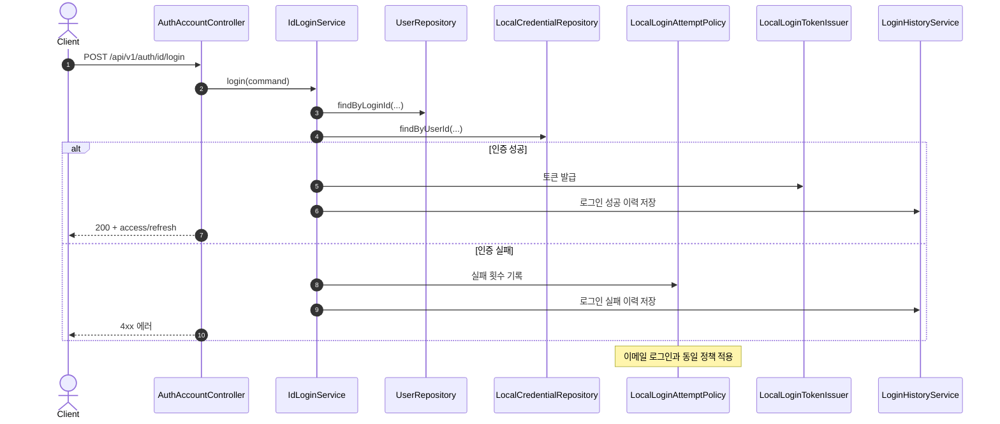
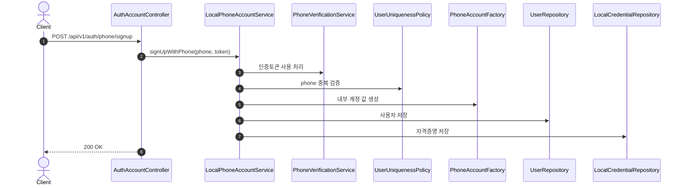
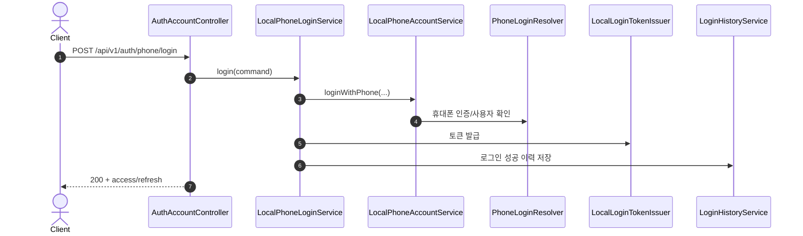
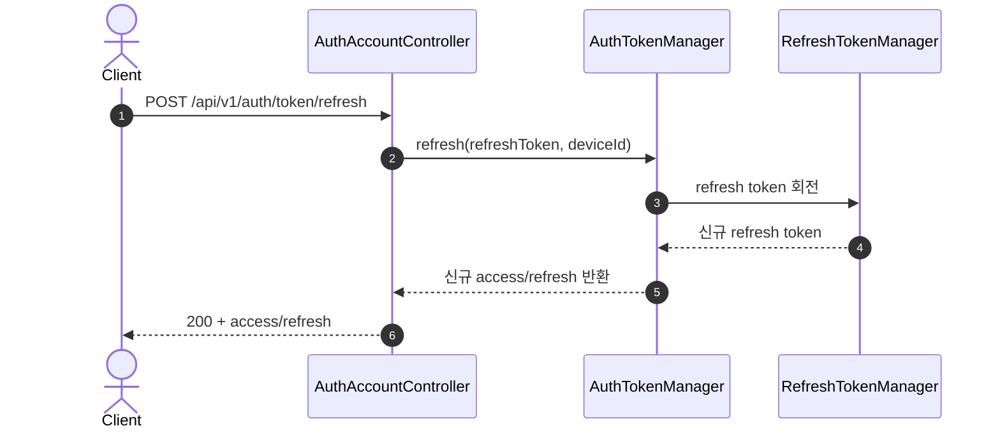

# Auth API Flow Guide

이 문서는 현재 인증 API가 어떤 레이어를 거쳐 처리되는지 빠르게 파악하기 위한 요약입니다.

## 1. 전체 구조

- Controller: 요청/응답 매핑, 헤더/인증 정보 추출
- Domain (`core/core-api`): 유스케이스 오케스트레이션, 정책 적용
- Storage (`storage/db-core`): DB 조회/저장

참조 방향은 `Controller -> Domain -> Storage` 단방향입니다.

## 2. 인증 수단별 API

- 이메일 로그인: `POST /api/v1/auth/email/login`
- 이메일 회원가입: `POST /api/v1/auth/email/signup`
- 아이디 로그인: `POST /api/v1/auth/id/login`
- 아이디 회원가입: `POST /api/v1/auth/id/signup`
- 휴대폰 로그인: `POST /api/v1/auth/phone/login`
- 휴대폰 회원가입: `POST /api/v1/auth/phone/signup`
- 휴대폰 인증 요청: `POST /api/v1/auth/local/phone-verifications/request`
- 휴대폰 인증 확인: `POST /api/v1/auth/local/phone-verifications/confirm`
- 토큰 갱신: `POST /api/v1/auth/token/refresh`

## 3. 이메일 로그인/회원가입

### 3.1 이메일 회원가입

1. `AuthAccountController.signUpWithEmail`
2. `LocalAccountService.signUp`
3. `UserUniquenessPolicy.validateSignUp` (이메일 중복 체크, phone은 선택)
4. `UserRepository.save`
5. `LocalCredentialRepository.save`

정책:

- 휴대폰 인증 토큰이 없어도 가입 가능

### 3.2 이메일 로그인

1. `LocalJsonLoginFilter` (`/api/v1/auth/email/login`)
2. `UserDetailsServiceImpl.loadUserByUsername` (email 기준)
3. `LocalLoginFailureHandler` or `LocalLoginSuccessHandler`
4. 성공 시 `AuthTokenManager.issue`, 실패 시 `LocalLoginAttemptPolicy.recordFailureByEmail`

## 4. 아이디 로그인/회원가입

### 4.1 아이디 회원가입

1. `AuthAccountController.signUpWithId`
2. `IdAccountService.signUp`
3. `PhoneVerificationService.consumeVerificationToken` (필수)
4. `UserUniquenessPolicy.validateLoginIdAvailable`, `validatePhoneAvailable`
5. `UserRepository.save` (`loginId` 저장)
6. `LocalCredentialRepository.save`

정책:

- 아이디 회원가입은 휴대폰 인증 필수

### 4.2 아이디 로그인

1. `AuthAccountController.loginWithId`
2. `IdLoginService.login`
3. `UserRepository.findByLoginId`
4. `LocalCredentialRepository.findByUserId` + 비밀번호 검증
5. 성공: `LocalLoginTokenIssuer.issue`, `LoginHistoryService.recordLoginSuccess`
6. 실패: `LocalLoginAttemptPolicy.recordFailureByEmail`, `LoginHistoryService.recordLoginFailure`

정책:

- 이메일 로그인과 동일한 실패/잠금 정책 사용
- 실패 결과는 `LOGIN_BAD_CREDENTIALS`, `LOGIN_ACCOUNT_NOT_FOUND`, `LOGIN_ATTEMPTS_EXCEEDED`로 매핑

## 5. 휴대폰 로그인/회원가입

### 5.1 휴대폰 회원가입

1. `AuthAccountController.signUpWithPhone`
2. `LocalPhoneAccountService.signUpWithPhone`
3. `PhoneVerificationService.consumeVerificationToken` (필수)
4. `UserUniquenessPolicy.validatePhoneAvailable`
5. `PhoneAccountFactory`로 내부 이메일/비밀번호 생성
6. `UserRepository.save` + `LocalCredentialRepository.save`

### 5.2 휴대폰 로그인

1. `AuthAccountController.loginWithPhone`
2. `LocalPhoneLoginService.login`
3. `LocalPhoneAccountService.loginWithPhone`
4. `PhoneLoginResolver` 정책 적용
5. `LocalLoginTokenIssuer.issue`
6. `LoginHistoryService.recordLoginSuccess`

## 6. 토큰 갱신

1. Controller (`AuthAccountController.refreshTokens`)
2. `AuthTokenManager.refresh`
3. `RefreshTokenManager.rotate`
4. 새 access/refresh 발급 후 응답

## 7. 최신 API 엔드포인트 보강 (2026-04-10 기준)

기존 본문은 흐름 설명 중심(레거시 경로 포함)이며, 최신 엔드포인트 기준은 아래와 같습니다.

- 기준 문서: `core/core-api/src/main/resources/static/docs/openapi3.yaml`

### 7.1 Health

- `GET /health`
- `GET /api/v1/auth/admin/health`

### 7.2 Local Auth / Local Phone / OAuth2

- `POST /api/v1/auth/local/signup`
- `POST /api/v1/auth/local/signup/phone`
- `POST /api/v1/auth/local/login` (Spring Security 로그인 엔드포인트)
- `POST /api/v1/auth/local/logout`
- `POST /api/v1/auth/local/withdraw`
- `POST /api/v1/auth/local/email/signup`
- `POST /api/v1/auth/local/id/signup`
- `POST /api/v1/auth/local/id/login`
- `POST /api/v1/auth/local/phone/signup`
- `POST /api/v1/auth/local/phone/login`
- `POST /api/v1/auth/local/login/phone`
- `POST /api/v1/auth/local/token/refresh`
- `POST /api/v1/auth/local/phone-verifications/request`
- `POST /api/v1/auth/local/phone-verifications/confirm`
- `GET /api/v1/auth/oauth2/{provider}/authorize-url`

### 7.3 Admin Users / Audit / Status

- `GET /api/v1/auth/admin/login-history`
- `GET /api/v1/auth/admin/users`
- `GET /api/v1/auth/admin/users/{userId}`
- `PATCH /api/v1/auth/admin/users/{userId}`
- `POST /api/v1/auth/admin/users/{userId}/password/reset`
- `POST /api/v1/auth/admin/users/{userId}/delete`
- `POST /api/v1/auth/admin/users/{userId}/tokens/revoke`
- `GET /api/v1/auth/admin/users/blocked`
- `POST /api/v1/auth/admin/users/{userId}/block`
- `POST /api/v1/auth/admin/users/{userId}/unblock`
- `GET /api/v1/auth/admin/users/deleted`
- `GET /api/v1/auth/admin/users/{userId}/status-audits`

### 7.4 Admin SMS

- `POST /api/v1/auth/admin/sms/send`
- `GET /api/v1/auth/admin/sms/logs`
- `GET /api/v1/auth/admin/sms/stats`
