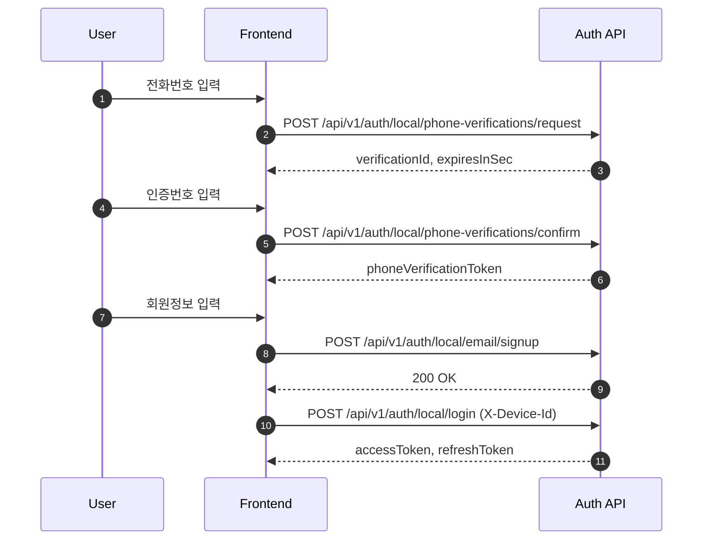
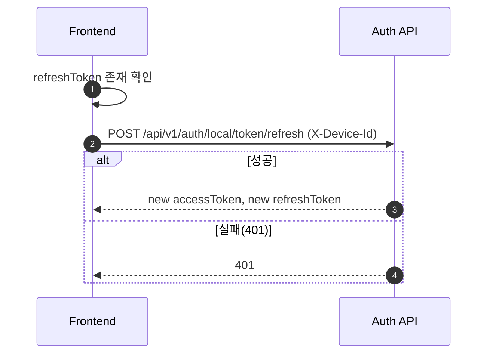
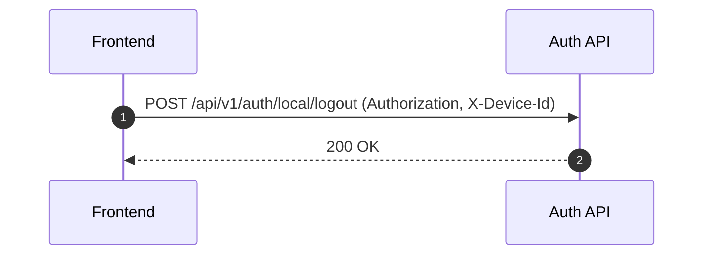
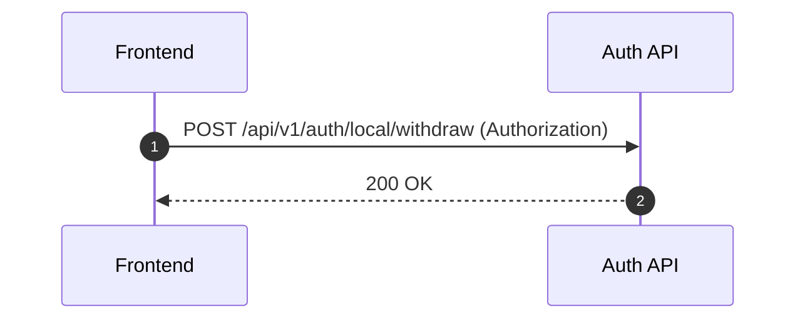
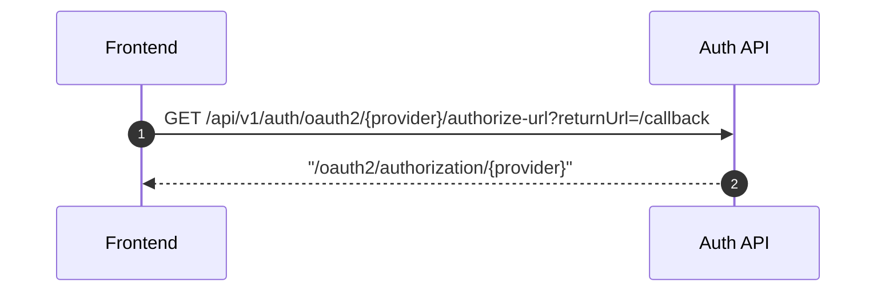

# 프론트엔드 사용자 API 개발 가이드

이 문서는 사용자 API만 다룹니다.
관리자 API(`/api/v1/auth/admin/*`)는 제외합니다.

## 1) API 확인 위치

- Swagger UI: `http://localhost:8080/swagger-ui/index.html`
- OpenAPI JSON: `http://localhost:8080/v3/api-docs`

## 2) 사용자 API 카테고리

### A. Health
- `GET /health`

### B. 휴대폰 인증
- `POST /api/v1/auth/local/phone-verifications/request`
- `POST /api/v1/auth/local/phone-verifications/confirm`

### C. Local Auth
- `POST /api/v1/auth/local/email/signup`
- `POST /api/v1/auth/local/id/signup`
- `POST /api/v1/auth/local/id/login`
- `POST /api/v1/auth/local/phone/signup`
- `POST /api/v1/auth/local/phone/login`
- `POST /api/v1/auth/local/login` (email/password 필터 로그인)
- `POST /api/v1/auth/local/token/refresh`
- `POST /api/v1/auth/local/logout`
- `POST /api/v1/auth/local/withdraw`
- `GET /api/v1/auth/local/session`

### D. OAuth2
- `GET /api/v1/auth/oauth2/{provider}/authorize-url`

## 3) 공통 규칙

### 헤더
- 사용자 인증: `Authorization: Bearer {accessToken}`
- 디바이스 식별 필요 API: `X-Device-Id: {deviceId}`

### 공통 에러 처리
- `401`: 토큰 만료/무효 -> refresh 시도 후 실패 시 로그인 이동
- `403`: 권한 없음
- `400`: 요청 검증 실패

### 토큰 저장 권장
- accessToken: 메모리 저장
- refreshToken: 보안 저장소(HTTP-only 쿠키 또는 안전한 앱 저장소)

## 4) 시퀀스 다이어그램

### 4-1) 휴대폰 인증 + 이메일 회원가입 + 로그인

### 4-2) 앱 재진입 시 토큰 재발급

### 4-3) 로그아웃

### 4-4) 회원 탈퇴

### 4-5) 소셜 로그인 시작

## 5) 프론트 체크리스트

- `X-Device-Id` 필요 API 누락 여부 확인
- 401 처리 시 refresh single-flight 제어
- refresh 실패 시 토큰 정리/로그인 이동
- 회원가입 전 휴대폰 인증 시퀀스 강제
- OpenAPI 스펙과 타입/DTO 일치 여부 확인
